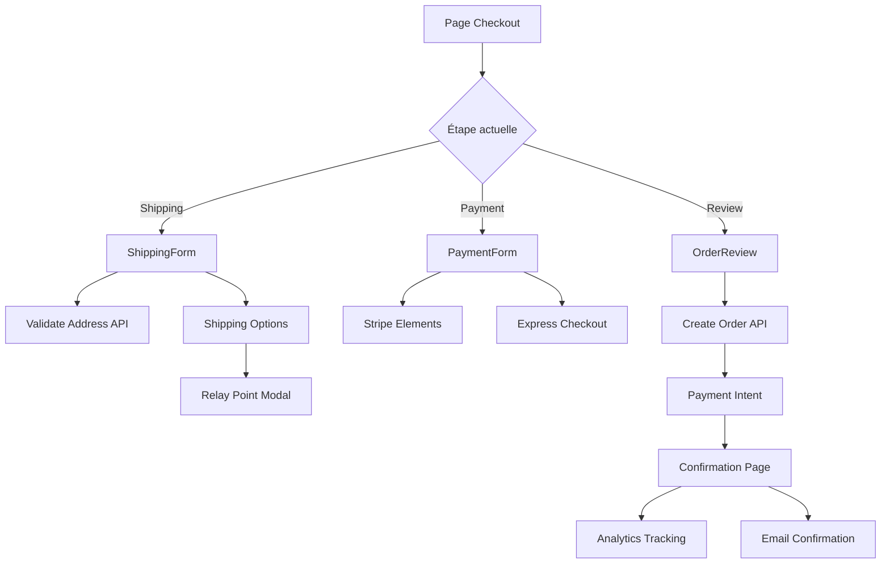

# Système de Checkout Avancé - Mientior

Ce document décrit l'implémentation complète du système de checkout multi-étapes pour Mientior, avec localisation française, animations avancées, et intégrations tierces.

## Table des matières

- [Vue d'ensemble](#vue-densemble)
- [Composants créés](#composants-créés)
- [Architecture](#architecture)
- [Flux de données](#flux-de-données)
- [Configuration](#configuration)
- [Guide d'intégration](#guide-dintégration)
- [Composants restants à implémenter](#composants-restants-à-implémenter)
- [API Routes](#api-routes)
- [Personnalisation](#personnalisation)
- [Troubleshooting](#troubleshooting)

## Vue d'ensemble

Le système de checkout est conçu comme un tunnel de conversion en 3 étapes :
1. **Livraison** : Saisie de l'adresse et sélection du mode de livraison
2. **Paiement** : Informations bancaires et facturation
3. **Confirmation** : Récapitulatif et confirmation de la commande

### Fonctionnalités principales

✅ **Implémenté** :
- Header minimal avec badge sécurisé
- Progress stepper animé avec traduction française
- Résumé de commande sticky (sidebar)
- Trust badges de réassurance
- Animations de succès avec confetti
- Page de confirmation complète
- Modal de sélection de points relais
- Options de paiement express (Apple Pay, Google Pay, PayPal)
- Sticky bar mobile responsive
- Tracking analytics complet
- Utilitaires de validation et formatting
- **Intégration Stripe Elements PCI-compliant**
- **CardPaymentForm avec CardNumberElement, CardExpiryElement, CardCvcElement**
- **Validation Zod superRefine pour adresse de facturation conditionnelle**
- **Création PaymentMethod avec billing_details complets**

🚧 **À finaliser** :
- Formulaires de livraison enrichis avec adresses sauvegardées
- API routes pour adresses sauvegardées
- Mise à jour du schéma Prisma
- Tests e2e du flux de paiement

## Composants créés

### 1. CheckoutHeader (`src/components/checkout/checkout-header.tsx`)

Header minimal pour le checkout avec :
- Logo centré
- Bouton retour
- Badge "Paiement sécurisé"
- Sticky positioning avec backdrop blur

**Utilisation** :
```tsx
import { CheckoutHeader } from '@/components/checkout'

<CheckoutHeader onBack={() => router.back()} />
```

### 2. ProgressStepper (`src/components/checkout/progress-stepper.tsx`)

Indicateur de progression avec :
- 3 étapes : Livraison, Paiement, Confirmation
- Animation pulse sur l'étape active
- Barre de progression linéaire
- Labels français
- Responsive (labels masqués sur mobile)

**Props** :
```typescript
interface ProgressStepperProps {
  currentStep: CheckoutStep // 'shipping' | 'payment' | 'review'
  completedSteps: CheckoutStep[]
  onStepClick?: (step: CheckoutStep) => void
  className?: string
}
```

### 3. TrustBadges (`src/components/checkout/trust-badges.tsx`)

Éléments de réassurance :
- Paiement sécurisé
- Livraison gratuite
- Retours 30 jours
- Support 24/7

**Props** :
```typescript
interface TrustBadgesProps {
  variant?: 'horizontal' | 'vertical'
  badges?: TrustBadge[]
  className?: string
}
```

### 4. OrderSummarySidebar (`src/components/checkout/order-summary-sidebar.tsx`)

Résumé de commande sticky avec :
- Aperçu des 3 premiers articles
- Compteur d'articles supplémentaires
- Récapitulatif des prix (sous-total, livraison, TVA, total)
- Trust badges intégrés
- Badge "Gratuit" pour livraison

**Props** :
```typescript
interface OrderSummarySidebarProps {
  items: CartItem[]
  subtotal: number
  shippingCost: number
  discount?: number
  tax: number
  total: number
  className?: string
}
```

### 5. OrderConfirmation (`src/components/checkout/order-confirmation.tsx`)

Page de confirmation avec :
- Animation de succès (checkmark + confetti)
- Message personnalisé
- Numéro de commande
- Récapitulatif complet
- Timeline "Que se passe-t-il maintenant ?"
- Actions (Suivre, Télécharger facture, Continuer achats)
- Section d'aide

**Props** :
```typescript
interface OrderConfirmationProps {
  order: Order
}
```

### 6. RelayPointModal (`src/components/checkout/relay-point-modal.tsx`)

Modal de sélection de points relais avec :
- Recherche par code postal
- Liste des points triés par distance
- Informations (adresse, horaires)
- Placeholder pour carte interactive
- Confirmation de sélection

**Props** :
```typescript
interface RelayPointModalProps {
  isOpen: boolean
  onClose: () => void
  onSelect: (relayPoint: RelayPoint) => void
  postalCode?: string
}
```

### 7. ExpressCheckout (`src/components/checkout/express-checkout.tsx`)

Options de paiement express :
- Apple Pay (si disponible)
- Google Pay (si disponible)
- PayPal Express
- Détection automatique de disponibilité

**Props** :
```typescript
interface ExpressCheckoutProps {
  total: number
  items: CartItem[]
  onSuccess?: (paymentData: unknown) => void
  className?: string
}
```

### 8. MobileStickyBar (`src/components/checkout/mobile-sticky-bar.tsx`)

Barre sticky mobile en bas d'écran avec :
- Total et nombre d'articles
- Bouton "Détail" ouvrant un drawer
- CTA principal
- Safe area padding pour notch

**Props** :
```typescript
interface MobileStickyBarProps {
  total: number
  itemCount: number
  onContinue: () => void
  ctaLabel: string
  disabled?: boolean
  children?: React.ReactNode
  className?: string
}
```

## Architecture

### Structure des fichiers

```
src/
├── components/
│   └── checkout/
│       ├── index.ts                      # Barrel export
│       ├── checkout-header.tsx           # ✅ Header minimal
│       ├── progress-stepper.tsx          # ✅ Indicateur progression
│       ├── trust-badges.tsx              # ✅ Badges réassurance
│       ├── order-summary-sidebar.tsx     # ✅ Résumé sticky
│       ├── order-confirmation.tsx        # ✅ Page confirmation
│       ├── relay-point-modal.tsx         # ✅ Modal points relais
│       ├── express-checkout.tsx          # ✅ Paiement express
│       ├── mobile-sticky-bar.tsx         # ✅ Barre mobile
│       ├── card-payment-form.tsx         # ✅ Stripe Elements separés
│       ├── payment-form.tsx              # ✅ Formulaire paiement complet
│       ├── shipping-form.tsx             # 🚧 À enrichir
│       └── shipping-options.tsx          # 🚧 À enrichir
├── app/
│   ├── (app)/
│   │   └── checkout/
│   │       ├── page.tsx                  # ✅ Page principale
│   │       ├── checkout-client.tsx       # ✅ Client avec Elements wrapper
│   │       └── confirmation/
│   │           └── [orderId]/
│   │               └── page.tsx          # ✅ Page confirmation
│   └── api/
│       └── checkout/
│           ├── validate-address/
│           │   └── route.ts              # ✅ Validation adresse
│           └── relay-points/
│               └── route.ts              # ✅ Points relais
├── lib/
│   ├── checkout-utils.ts                 # ✅ Utilitaires + validation FR
│   ├── stripe-client.ts                  # ✅ Singleton Stripe loader
│   └── analytics.ts                      # ✅ Tracking
├── hooks/
│   └── use-checkout-analytics.ts         # ✅ Hook analytics
└── types/
    └── index.ts                          # ✅ Types checkout

```

### Flux de données



## Configuration

### Variables d'environnement

Ajoutez ces variables à votre `.env.local` :

```bash
# Stripe
NEXT_PUBLIC_STRIPE_PUBLISHABLE_KEY=pk_test_...
STRIPE_SECRET_KEY=sk_test_...

# Analytics (optionnel)
NEXT_PUBLIC_GA_ID=G-XXXXXXXXXX
NEXT_PUBLIC_FB_PIXEL_ID=XXXXXXXXXX

# APIs externes (optionnel)
MONDIAL_RELAY_API_KEY=...
COLISSIMO_API_KEY=...
```

### Installation des dépendances

Les dépendances nécessaires ont été ajoutées à `package.json` :

```bash
npm install @stripe/react-stripe-js @stripe/stripe-js canvas-confetti date-fns
npm install --save-dev @types/canvas-confetti
```

## Guide d'intégration

### Étape 1 : Mise à jour du schéma Prisma

Ajoutez le modèle `SavedAddress` et enrichissez `Order` :

```prisma
model SavedAddress {
  id         String   @id @default(cuid())
  userId     String
  user       User     @relation(fields: [userId], references: [id], onDelete: Cascade)

  firstName  String
  lastName   String
  line1      String
  line2      String?
  city       String
  postalCode String
  country    String   @default("FR")
  phone      String

  isDefault  Boolean  @default(false)
  createdAt  DateTime @default(now())
  updatedAt  DateTime @updatedAt

  @@index([userId])
  @@index([userId, isDefault])
}

// Ajoutez ces champs au modèle Order existant
model Order {
  // ... champs existants

  orderNumber       String   @unique
  couponCode        String?
  shippingMethod    String?
  estimatedDelivery DateTime?
  paymentType       String?
  paymentBrand      String?
  paymentLast4      String?
}
```

Puis exécutez :
```bash
npx prisma migrate dev --name add_checkout_features
npx prisma generate
```

### Étape 2 : Créer l'API pour les adresses sauvegardées

Créez `src/app/api/user/addresses/route.ts` :

```typescript
import { NextRequest, NextResponse } from 'next/server'
import { getSession } from '@/lib/auth-server'
import { prisma } from '@/lib/prisma'

export async function GET() {
  const session = await getSession()
  if (!session?.user) {
    return NextResponse.json({ error: 'Unauthorized' }, { status: 401 })
  }

  const addresses = await prisma.savedAddress.findMany({
    where: { userId: session.user.id },
    orderBy: [{ isDefault: 'desc' }, { createdAt: 'desc' }],
  })

  return NextResponse.json({ data: addresses })
}

export async function POST(request: NextRequest) {
  const session = await getSession()
  if (!session?.user) {
    return NextResponse.json({ error: 'Unauthorized' }, { status: 401 })
  }

  const data = await request.json()

  // Si isDefault, désactiver les autres adresses par défaut
  if (data.isDefault) {
    await prisma.savedAddress.updateMany({
      where: { userId: session.user.id, isDefault: true },
      data: { isDefault: false },
    })
  }

  const address = await prisma.savedAddress.create({
    data: {
      ...data,
      userId: session.user.id,
    },
  })

  return NextResponse.json({ data: address })
}
```

### Étape 3 : Enrichir ShippingForm

Ajoutez ces fonctionnalités au composant existant `shipping-form.tsx` :

```typescript
// Récupération des adresses sauvegardées
const { data: savedAddresses } = useSWR('/api/user/addresses')

// Auto-complétion du code postal
const handlePostalCodeChange = async (value: string) => {
  if (value.length === 5) {
    const response = await fetch(`/api/checkout/validate-address?postalCode=${value}`)
    const data = await response.json()

    if (data.success && data.data.cities.length > 0) {
      // Pré-remplir la ville
      setValue('city', data.data.cities[0].city)
    }
  }
}

// Sélection d'une adresse sauvegardée
const handleAddressSelect = (address: SavedAddress) => {
  setValue('firstName', address.firstName)
  setValue('lastName', address.lastName)
  setValue('line1', address.line1)
  setValue('line2', address.line2 || '')
  setValue('city', address.city)
  setValue('postalCode', address.postalCode)
  setValue('phone', address.phone)
}
```

### Étape 4 : Enrichir ShippingOptions

Ajoutez l'option Point Relais :

```typescript
const [showRelayModal, setShowRelayModal] = useState(false)
const [selectedRelayPoint, setSelectedRelayPoint] = useState<RelayPoint | null>(null)

// Dans le rendu
{option.id === 'relay' && (
  <Button
    type="button"
    variant="outline"
    onClick={() => setShowRelayModal(true)}
  >
    {selectedRelayPoint
      ? `${selectedRelayPoint.name} - ${selectedRelayPoint.distance}km`
      : 'Choisir un point relais'
    }
  </Button>
)}

<RelayPointModal
  isOpen={showRelayModal}
  onClose={() => setShowRelayModal(false)}
  onSelect={(point) => {
    setSelectedRelayPoint(point)
    analytics.trackRelayPoint(point.id)
  }}
  postalCode={shippingAddress?.postalCode}
/>
```

### Étape 5 : Intégrer Stripe Elements dans PaymentForm

✅ **Déjà implémenté** - Le système de paiement Stripe est maintenant complet avec :

#### CardPaymentForm (`src/components/checkout/card-payment-form.tsx`)

Composant PCI-compliant utilisant les Stripe Elements séparés :
- **CardNumberElement** : Numéro de carte avec détection automatique du type
- **CardExpiryElement** : Date d'expiration MM/YY
- **CardCvcElement** : Cryptogramme avec tooltip explicatif
- **Input pour nom du titulaire** : En majuscules avec tracking-[0.2em]
- **Checkbox "Sauvegarder"** : Pour enregistrer la carte via Stripe
- **Badge sécurité** : Affichage SSL/cryptage

```typescript
interface CardPaymentFormProps {
  onCardComplete: (complete: boolean) => void
  onError: (error?: string) => void
  saveCard: boolean
  onSaveCardChange: (checked: boolean) => void
  isLoading?: boolean
}
```

**Fonctionnalités** :
- Validation temps réel de chaque champ (card, expiry, cvc, name)
- État `overallComplete` calculé uniquement si tous les champs sont valides
- Gestion des erreurs Stripe avec affichage utilisateur
- Style personnalisé correspondant au design system (orange-500, platinum, etc.)
- États de chargement avec overlay backdrop-blur

#### PaymentForm mis à jour

**Validation Zod améliorée** :
```typescript
const paymentSchema = z.object({
  paymentMethod: z.enum(['card', 'apple-pay', 'google-pay']),
  saveCard: z.boolean().default(false),
  billingAddressSameAsShipping: z.boolean().default(true),
  
  // Champs billing optionnels mais requis si different
  billingFirstName: z.string().optional(),
  billingLastName: z.string().optional(),
  billingLine1: z.string().optional(),
  billingLine2: z.string().optional(),
  billingCity: z.string().optional(),
  billingPostalCode: z.string().optional(),
  billingCountry: z.string().optional(),
  billingPhone: z.string().optional(),
  
  acceptTerms: z.boolean().refine(val => val === true),
  acceptNewsletter: z.boolean().default(false),
}).superRefine((data, ctx) => {
  if (!data.billingAddressSameAsShipping) {
    // Validation conditionnelle de tous les champs requis
    // avec minLength, validateFrenchPostalCode, validateFrenchPhone
    // Messages FR : "Prénom requis", "Code postal invalide (5 chiffres FR)", etc.
  }
})
```

**Création PaymentMethod** :
```typescript
const { error, paymentMethod } = await stripe.createPaymentMethod({
  type: 'card',
  card: elements!.getElement(CardNumberElement)!,
  billing_details: {
    name: `${firstName} ${lastName}`,
    email: shipping.email,
    phone: billingPhone || shipping.phone,
    address: {
      line1: billingLine1 || shipping.line1,
      city: billingCity || shipping.city,
      postal_code: billingPostalCode || shipping.postalCode,
      country: billingCountry || shipping.country,
    },
  },
})

if (!error) {
  onSubmit({
    paymentMethod: 'card',
    paymentMethodId: paymentMethod.id,
    billingAddress: buildBillingAddress(data),
    saveCard: data.saveCard,
  })
}
```

**UI améliorée** :
- RadioGroup pour "Même adresse / Autre adresse" au lieu d'une simple checkbox
- Tous les inputs billing avec `className="h-12"` et `aria-invalid`
- Select country avec `value={field.value}` pour éviter les warnings React
- Placeholder tel : `"+33 6 12 34 56 78"`
- Submit button disabled si `!form.formState.isValid || (card && !cardComplete)`

#### CheckoutPageClient wrapper

```typescript
import { Elements } from '@stripe/react-stripe-js'
import { getStripe } from '@/lib/stripe-client'

<Elements
  stripe={getStripe()}
  options={{
    mode: 'payment',
    amount: total,
    currency: 'eur',
    appearance: {
      theme: 'stripe',
      variables: {
        colorPrimary: '#f97316', // orange-500
        colorBackground: '#ffffff',
        colorText: '#1a1a1a',
        colorDanger: '#dc2626',
        fontFamily: 'system-ui, sans-serif',
        spacingUnit: '4px',
        borderRadius: '6px',
      },
    },
  }}
>
  <PaymentForm
    onSubmit={handlePaymentSubmit}
    onBack={handleBackToShipping}
    isLoading={isLoading}
    shippingAddress={shippingAddress}
    total={total}
  />
</Elements>
```

#### Stripe Client Singleton (`src/lib/stripe-client.ts`)

```typescript
import { loadStripe, Stripe } from '@stripe/stripe-js'

let stripePromise: Promise<Stripe | null>

export const getStripe = (): Promise<Stripe | null> => {
  if (!stripePromise) {
    stripePromise = loadStripe(process.env.NEXT_PUBLIC_STRIPE_PUBLISHABLE_KEY!)
  }
  return stripePromise
}
```

**Sécurité PCI-DSS** :
- Aucune donnée de carte ne transite par nos serveurs
- Token Stripe (`paymentMethod.id`) uniquement
- Backend utilise `stripe.paymentIntents.confirm()` avec secret key
- Conformité 3D Secure (SCA) automatique

**Analytics intégré** :
```typescript
const { trackPaymentMethod } = useCheckoutAnalytics({ step, items, total })

// Appelé lors de la sélection de méthode
trackPaymentMethod('card') // ou 'apple-pay', 'google-pay'
```
            },
          },
        }}
      />
      <Button type="submit" disabled={!stripe}>
        Valider le paiement
      </Button>
    </form>
  )
}

export function PaymentForm() {
  return (
    <Elements stripe={stripePromise}>
      <PaymentFormContent />
    </Elements>
  )
}
```

## Composants restants à implémenter

### ShippingForm enrichi
- ✅ Types définis
- 🚧 Section adresses sauvegardées
- 🚧 Auto-complétion ville basée sur code postal
- 🚧 Validation numéro téléphone français
- 🚧 Checkbox "Sauvegarder cette adresse"

### ShippingOptions enrichi
- ✅ Types définis
- 🚧 Option Point Relais avec modal
- 🚧 Calcul date d'arrivée estimée
- 🚧 Badge "Gratuit" conditionnel

### PaymentForm enrichi
- ✅ Types définis
- 🚧 Intégration Stripe Elements
- 🚧 Détection type de carte
- 🚧 Section adresse facturation
- 🚧 Badges sécurité (SSL, PCI-DSS)

### CheckoutPageClient
- 🚧 Gestion d'état complète
- 🚧 Validation avant changement d'étape
- 🚧 Intégration tracking analytics
- 🚧 Gestion erreurs avec toasts
- 🚧 Redirection vers confirmation

## API Routes

### Routes implémentées

#### GET `/api/checkout/validate-address`
Auto-complétion ville basée sur code postal.

**Query params** :
- `postalCode`: Code postal (5 chiffres)

**Response** :
```json
{
  "success": true,
  "data": {
    "postalCode": "75001",
    "cities": [
      {
        "city": "Paris",
        "postalCode": "75001",
        "department": "Paris",
        "region": "Île-de-France"
      }
    ]
  }
}
```

#### POST `/api/checkout/validate-address`
Validation complète d'une adresse.

#### GET `/api/checkout/relay-points`
Récupération des points relais.

**Query params** :
- `postalCode`: Code postal
- `city` (optionnel): Ville
- `limit` (défaut: 10): Nombre de résultats

**Response** :
```json
{
  "success": true,
  "data": [
    {
      "id": "relay-1",
      "name": "Relay Point - Bureau de Tabac",
      "address": "15 Rue de la République",
      "city": "Paris",
      "postalCode": "75001",
      "distance": 0.5,
      "openingHours": ["Lun-Ven: 08:00-19:00"],
      "coordinates": { "lat": 48.8566, "lng": 2.3522 }
    }
  ]
}
```

### Routes à créer

#### GET `/api/user/addresses`
Récupérer les adresses sauvegardées de l'utilisateur.

#### POST `/api/user/addresses`
Sauvegarder une nouvelle adresse.

#### PUT `/api/user/addresses/[id]`
Modifier une adresse.

#### DELETE `/api/user/addresses/[id]`
Supprimer une adresse.

## Personnalisation

### Traductions

Toutes les chaînes sont en français. Pour ajouter d'autres langues, créez un système i18n :

```typescript
// src/lib/i18n/checkout.ts
export const checkoutTranslations = {
  fr: {
    shipping: {
      title: 'Livraison',
      description: 'Adresse & mode de livraison',
    },
    // ...
  },
  en: {
    shipping: {
      title: 'Shipping',
      description: 'Address & delivery method',
    },
    // ...
  },
}
```

### Options de livraison

Personnalisez dans `src/lib/checkout-utils.ts` :

```typescript
export function calculateShipping(subtotal: number, option: string) {
  const freeShippingThreshold = 50 // Modifier ici

  if (option === 'standard' && subtotal >= freeShippingThreshold) return 0
  if (option === 'standard') return 4.99 // Prix standard
  if (option === 'express') return 9.99  // Prix express
  if (option === 'relay') return 3.99    // Prix relay

  return 0
}
```

### Couleurs et style

Le système utilise les couleurs du design system :
- `orange-500` : Actions principales
- `success` : Validations, badges positifs
- `platinum-*` : Backgrounds et bordures
- `anthracite-*` : Textes principaux
- `nuanced-*` : Textes secondaires

Modifiez dans `tailwind.config.ts` pour personnaliser.

## Troubleshooting

### Erreur: "getCachedData is not defined"

Assurez-vous que Redis est configuré :
```bash
# .env.local
REDIS_URL=redis://localhost:6379
```

Si Redis n'est pas disponible, créez une implémentation fallback :
```typescript
// src/lib/redis.ts
export async function getCachedData(key, fetcher, ttl) {
  // Pas de cache, appel direct
  return await fetcher()
}
```

### Erreur: "Canvas-confetti not found"

Installez la dépendance :
```bash
npm install canvas-confetti @types/canvas-confetti
```

### Les animations ne fonctionnent pas

Vérifiez que `globals.css` contient les animations checkout et que l'utilisateur n'a pas `prefers-reduced-motion` activé.

### Stripe Elements ne s'affiche pas

Vérifiez que :
1. `NEXT_PUBLIC_STRIPE_PUBLISHABLE_KEY` est définie
2. Les composants sont wrappés dans `<Elements stripe={stripePromise}>`
3. La clé publique est valide

## Prochaines étapes

1. **Finaliser les formulaires** : ShippingForm et PaymentForm avec toutes les fonctionnalités
2. **Compléter CheckoutPageClient** : Logique complète du tunnel
3. **Tests** : Tests unitaires et E2E du flux complet
4. **Intégrations réelles** : Remplacer les mocks par les vraies APIs (Mondial Relay, etc.)
5. **Carte interactive** : Intégrer Leaflet ou Google Maps dans RelayPointModal
6. **Email templates** : Templates d'email pour confirmation
7. **Optimisations** : Code splitting, lazy loading
8. **A/B Testing** : Tester différentes variantes du tunnel

## Support

Pour toute question ou problème :
- Consultez la documentation Stripe : https://stripe.com/docs
- API Adresse française : https://adresse.data.gouv.fr/api-doc/adresse
- Issues GitHub du projet

---

**Version** : 1.0.0
**Dernière mise à jour** : Novembre 2025
**Auteur** : Claude Code avec instructions détaillées
