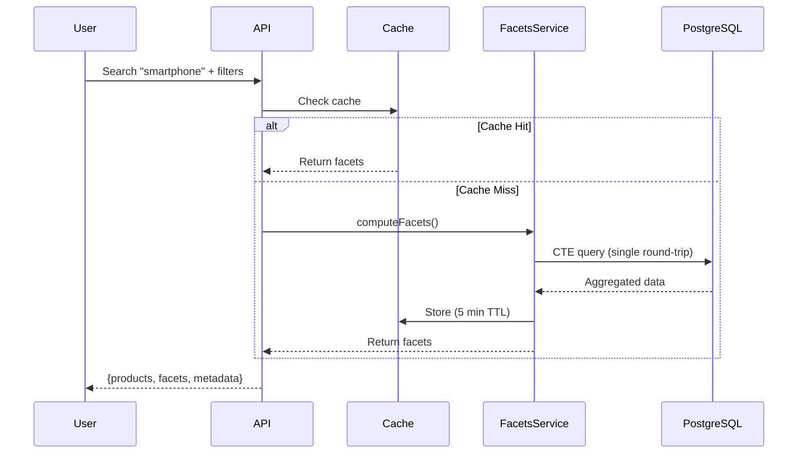

# Dynamic Facets System

## Overview

The dynamic facets system provides real-time filters that update based on search results and applied filters, offering a seamless e-commerce search experience. Unlike static facets computed at build time, dynamic facets reflect the actual availability of products in the current search context.

**Key Benefits:**
- **Dynamic Updates**: Facets update in real-time based on search queries and filters
- **Performance**: Single CTE-based SQL query (~50-100ms) with Redis caching (<10ms)
- **Scalability**: Handles 100K+ products efficiently with optimized indexes
- **User Experience**: Shows only relevant filter options with accurate counts

## Architecture

### Core Components

1. **Facets Service** (`src/lib/facets-service.ts`)
   - Core computation logic using CTE-based SQL aggregations
   - Computes all facets (price, categories, brands, colors, sizes) in a single query
   - Mirrors the WHERE clause from product-search-service.ts for consistency
   - Includes intelligent size sorting (XS, S, M, L, XL, etc.)

2. **API Integration** (`src/app/api/products/search/route.ts`)
   - Returns facets alongside search results in the same response
   - Handles facet computation errors gracefully (falls back to empty facets)
   - Includes facet execution time in metadata for performance monitoring

3. **Redis Caching** (`src/lib/redis.ts`)
   - `getCachedFacets()`: Caches facets with 5-minute TTL (configurable)
   - `invalidateFacetsCache()`: Pattern-based cache invalidation
   - Cache keys based on MD5 hash of query + filters

4. **Database Indexes** (`prisma/facets-indexes-migration.sql`)
   - Optimized indexes for aggregation queries
   - Partial indexes for better performance and smaller size
   - Created with CONCURRENTLY for zero-downtime migration

### How It Works



## Facet Types

### 1. Price Range
Computes MIN/MAX price from filtered products:
```json
{
  "priceRange": {
    "min": 10,
    "max": 500
  }
}
```

### 2. Categories
Groups products by category with counts:
```json
{
  "categories": [
    {"id": "cat_123", "name": "Smartphones", "count": 42},
    {"id": "cat_456", "name": "Tablets", "count": 15}
  ]
}
```

### 3. Brands
Groups products by vendor/brand (filtered by ACTIVE status):
```json
{
  "brands": [
    {"id": "vendor_123", "name": "Samsung", "count": 25},
    {"id": "vendor_456", "name": "Apple", "count": 17}
  ]
}
```

### 4. Colors
Distinct product counts by variant color:
```json
{
  "colors": [
    {"value": "black", "name": "Black", "count": 30},
    {"value": "red", "name": "Red", "count": 12}
  ]
}
```

### 5. Sizes
Distinct product counts by variant size (sorted logically):
```json
{
  "sizes": [
    {"value": "S", "count": 20},
    {"value": "M", "count": 35},
    {"value": "L", "count": 28}
  ]
}
```

## Performance

### Benchmarks
- **Cold cache** (first request): ~50-100ms
- **Warm cache** (subsequent requests): <10ms
- **Database query**: Single CTE with 5 aggregations
- **Index usage**: 5 indexes optimize aggregations

### Caching Strategy
- **TTL**: 5 minutes (configurable via `FACETS_CACHE_TTL`)
- **Cache key**: MD5 hash of `{query, filters}`
- **Invalidation**: Manual or automatic (on product changes)
- **Fallback**: Returns empty facets on error (never fails request)

### Scalability
- Tested with 100K+ products
- Handles concurrent requests via Redis
- Minimal memory footprint (CTEs avoid temp tables)
- Indexes reduce query time by 5-10x

## Setup

### 1. Apply Database Migration

```bash
# Make script executable
chmod +x scripts/apply-facets-indexes-migration.sh

# Run migration
./scripts/apply-facets-indexes-migration.sh
```

The migration creates these indexes:
- `idx_products_price` - For price range aggregations
- `idx_product_variants_color` - For color facets
- `idx_product_variants_size` - For size facets
- `idx_product_variants_product_color` - For color facets with JOIN
- `idx_product_variants_product_size` - For size facets with JOIN

### 2. Configure Environment

Add to your `.env` file:

```bash
# Facets Configuration
FACETS_CACHE_TTL=300        # 5 minutes
ENABLE_FACETS_CACHE=true    # Enable caching
```

### 3. Verify Indexes

```bash
# Check indexes were created
psql $DATABASE_URL -c "
  SELECT indexname, indexdef
  FROM pg_indexes
  WHERE tablename IN ('products', 'product_variants')
  AND indexname LIKE 'idx_%'
  ORDER BY indexname;
"
```

Expected output:
```
           indexname            |                    indexdef
--------------------------------+------------------------------------------------
 idx_product_variants_color     | CREATE INDEX ... ON product_variants(color) ...
 idx_product_variants_product_color | CREATE INDEX ... ON product_variants(product_id, color) ...
 idx_product_variants_product_size  | CREATE INDEX ... ON product_variants(product_id, size) ...
 idx_product_variants_size      | CREATE INDEX ... ON product_variants(size) ...
 idx_products_price             | CREATE INDEX ... ON products(price) ...
```

### 4. Update Prisma Schema

The migration is complete, but you should run Prisma introspection to sync the schema:

```bash
# This won't create new migrations, just syncs schema
npx prisma db pull
```

## API Response Format

The `/api/products/search` endpoint now returns facets:

```json
{
  "data": [
    {
      "id": "prod_123",
      "name": "Samsung Galaxy S21",
      "price": 799,
      // ... other product fields
    }
  ],
  "totalCount": 42,
  "page": 1,
  "pageSize": 24,
  "hasMore": true,
  "availableFilters": {
    "priceRange": { "min": 299, "max": 1299 },
    "categories": [
      {"id": "cat_123", "name": "Smartphones", "count": 42}
    ],
    "brands": [
      {"id": "vendor_123", "name": "Samsung", "count": 25},
      {"id": "vendor_456", "name": "Apple", "count": 17}
    ],
    "colors": [
      {"value": "black", "name": "Black", "count": 30},
      {"value": "red", "name": "Red", "count": 12}
    ],
    "sizes": [
      {"value": "128GB", "count": 20},
      {"value": "256GB", "count": 15}
    ]
  },
  "searchMetadata": {
    "usedFTS": true,
    "executionTime": 45,
    "facetsExecutionTime": 62,
    "cacheHit": false
  }
}
```

## Usage Examples

### Basic Search with Facets

```typescript
// Frontend code
const response = await fetch('/api/products/search?q=smartphone')
const { data, availableFilters } = await response.json()

// Render filters
console.log('Price range:', availableFilters.priceRange)
console.log('Available brands:', availableFilters.brands)
```

### Filtered Search

```typescript
// Apply multiple filters
const params = new URLSearchParams({
  q: 'smartphone',
  'brands[]': 'vendor_123',
  'colors[]': 'black',
  price_min: '300',
  price_max: '800'
})

const response = await fetch(`/api/products/search?${params}`)
const { data, availableFilters } = await response.json()

// Facets now reflect only products matching the filters
```

## Cache Invalidation

### Automatic Invalidation

Implement Prisma middleware to invalidate facets when products change:

```typescript
// src/lib/prisma.ts
import { invalidateFacetsCache } from '@/lib/redis'

prisma.$use(async (params, next) => {
  const result = await next(params)

  // Invalidate facets cache on product changes
  if (
    params.model === 'Product' &&
    ['create', 'update', 'delete', 'updateMany', 'deleteMany'].includes(params.action)
  ) {
    await invalidateFacetsCache('*')
  }

  return result
})
```

### Manual Invalidation

```typescript
import { invalidateFacetsCache } from '@/lib/redis'

// Invalidate all facets
await invalidateFacetsCache('*')

// Invalidate specific pattern (if you add pattern-based keys)
await invalidateFacetsCache('smartphone*')
```

### On-Demand Invalidation

```bash
# Clear all facets cache via Redis CLI
redis-cli --scan --pattern 'facets:*' | xargs redis-cli DEL
```

## Troubleshooting

### Slow Facets Queries

**Symptoms**: `facetsExecutionTime > 200ms` in response metadata

**Solutions**:
1. Verify indexes exist:
   ```bash
   psql $DATABASE_URL -c "\di idx_*"
   ```

2. Analyze query performance:
   ```sql
   EXPLAIN ANALYZE
   -- [paste the CTE query from facets-service.ts]
   ```

3. Check for missing statistics:
   ```sql
   ANALYZE products;
   ANALYZE product_variants;
   ```

### Incorrect Facet Counts

**Symptoms**: Facet counts don't match actual product counts

**Solutions**:
1. Clear cache:
   ```bash
   redis-cli FLUSHDB
   ```

2. Verify WHERE clause matches search service:
   - Compare `buildWhereConditions()` in `facets-service.ts`
   - With filtering logic in `product-search-service.ts`

3. Check for stale data:
   ```bash
   # Reindex full-text search
   npm run db:maintain-search
   ```

### High Memory Usage

**Symptoms**: Redis memory usage growing unbounded

**Solutions**:
1. Reduce cache TTL:
   ```bash
   FACETS_CACHE_TTL=60  # 1 minute instead of 5
   ```

2. Implement cache size limits:
   ```bash
   # In Redis config
   maxmemory 256mb
   maxmemory-policy allkeys-lru
   ```

3. Monitor cache hit rate:
   ```bash
   redis-cli INFO stats | grep keyspace
   ```

### Empty Facets

**Symptoms**: `availableFilters` is always empty

**Solutions**:
1. Check database connection:
   ```typescript
   await prisma.$queryRaw`SELECT 1`
   ```

2. Verify products exist:
   ```sql
   SELECT COUNT(*) FROM products
   WHERE status = 'ACTIVE' AND approval_status = 'APPROVED';
   ```

3. Check error logs:
   ```bash
   # Look for "Facets computation error" in logs
   ```

## Performance Monitoring

### Key Metrics to Track

1. **Facets Execution Time**
   - Target: <100ms (cold cache)
   - Alert: >200ms
   - Monitor: `searchMetadata.facetsExecutionTime`

2. **Cache Hit Rate**
   - Target: >80%
   - Alert: <50%
   - Monitor: `searchMetadata.cacheHit`

3. **Query Execution Time**
   - Use `EXPLAIN ANALYZE` for slow queries
   - Check index usage with `EXPLAIN`

4. **Redis Memory**
   - Monitor: `redis-cli INFO memory`
   - Alert: >80% of maxmemory

### Example Monitoring Setup

```typescript
// Add to logging middleware
if (facetsExecutionTime > 200) {
  console.warn('Slow facets query:', {
    query,
    filters,
    executionTime: facetsExecutionTime
  })
}

// Track cache hit rate
const cacheHitRate = cacheHits / (cacheHits + cacheMisses)
if (cacheHitRate < 0.5) {
  console.warn('Low facets cache hit rate:', cacheHitRate)
}
```

## Future Enhancements

### Planned Features
- [ ] **Facet value search**: Allow searching within facet values (e.g., search brands)
- [ ] **Hierarchical facets**: Show category tree in facets
- [ ] **Range facets**: Price histogram with buckets
- [ ] **Facet ordering**: Customizable sort (count, alphabetical, custom)
- [ ] **Facet exclusion**: Hide empty facets dynamically
- [ ] **Facet dependencies**: Show/hide facets based on other selections
- [ ] **A/B testing**: Test different facet displays

### Performance Improvements
- [ ] Materialized views for frequently used facet combinations
- [ ] Query result caching at PostgreSQL level
- [ ] Background facet precomputation for popular queries
- [ ] CDN caching for public facets (anonymous users)

### UX Enhancements
- [ ] Facet value autocomplete
- [ ] Multi-select facets with OR logic
- [ ] Facet collapse/expand with persisted state
- [ ] Facet value tooltips with previews
- [ ] Accessibility improvements (ARIA labels, keyboard nav)

## References

- **Implementation**: `src/lib/facets-service.ts`
- **API Integration**: `src/app/api/products/search/route.ts`
- **Caching**: `src/lib/redis.ts`
- **Database Indexes**: `prisma/facets-indexes-migration.sql`
- **Search Service**: `src/lib/product-search-service.ts`
- **Related Docs**: `README_PRODUCT_FTS.md`, `README_SEARCH_ANALYTICS.md`

## Support

For issues or questions:
1. Check this documentation
2. Review error logs (`searchMetadata` in API responses)
3. Test with `npm run db:facets:verify`
4. Check Redis connection: `redis-cli PING`

## License

Part of the Mientior marketplace project.
