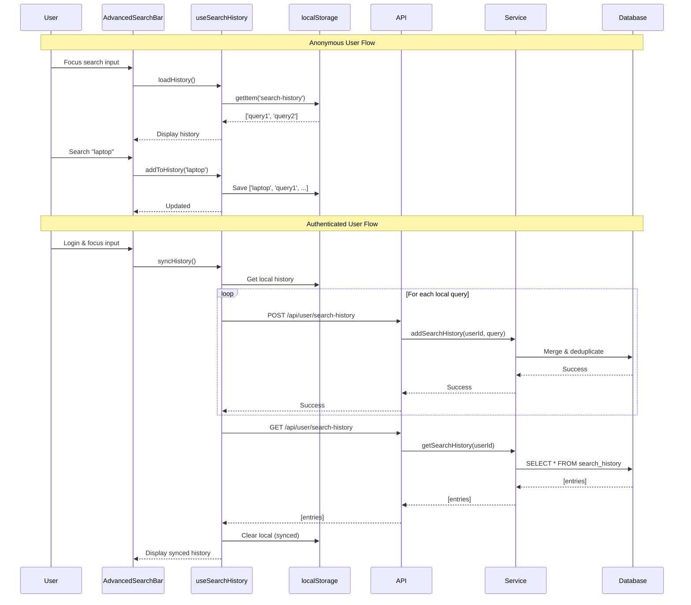

# Search History System

## Overview

The Search History system provides a dual-storage solution for tracking user search queries, combining instant client-side feedback with persistent server-side storage. This architecture ensures:

- **Instant feedback**: localStorage provides immediate response for anonymous users
- **Cross-device sync**: Authenticated users can access their search history from any device
- **Privacy-aware**: Anonymous users' history stays local, authenticated users choose to sync
- **Automatic cleanup**: Maximum 10 entries per user with automatic deduplication

## Benefits

1. **Improved User Experience**: Users can quickly re-run previous searches without retyping
2. **Personalization**: History can inform search ranking and recommendations in the future
3. **Analytics**: Aggregate data provides insights into user search patterns
4. **Performance**: localStorage provides instant access without network latency

## Architecture



### Sync Strategy

- **Anonymous users**: localStorage only
- **Authenticated users**:
  - Write to both localStorage (instant feedback) + backend (persistence)
  - On login: Client-side sync posts each localStorage query to `/api/user/search-history`, then fetches merged backend history and clears localStorage
  - On focus: Show localStorage first (instant), then backend if authenticated

**Implementation Note**: Sync is purely client-driven. The `syncHistory()` function in `useSearchHistory` calls the POST endpoint multiple times (once per local query) instead of using a dedicated bulk sync endpoint. This design keeps the API simple while leveraging existing deduplication logic in `addSearchHistory()`.

## Database Schema

### SearchHistory Model

```prisma
model SearchHistory {
  id             String   @id @default(cuid())
  userId         String
  query          String // Original query with preserved casing
  normalizedQuery String  @map("normalized_query") // Lowercase version for deduplication
  timestamp      DateTime @default(now())

  user User @relation(fields: [userId], references: [id], onDelete: Cascade)

  @@index([userId])
  @@index([userId, timestamp])
  @@index([userId, normalizedQuery])
  @@map("search_history")
}
```

**Indexes:**
- `[userId]`: Fast lookups of user's entire history
- `[userId, timestamp]`: Optimized for ordered retrieval (most recent first)
- `[userId, normalizedQuery]`: Efficient deduplication checks while preserving original casing

**Relationships:**
- Cascading delete on user deletion (GDPR compliance)

## API Endpoints

### GET /api/user/search-history

Fetch the authenticated user's search history.

**Authentication**: Required

**Response:**
```json
{
  "data": [
    {
      "query": "laptop",
      "timestamp": "2025-11-30T10:30:00.000Z"
    },
    {
      "query": "smartphone",
      "timestamp": "2025-11-29T15:20:00.000Z"
    }
  ],
  "success": true
}
```

**Example:**
```bash
curl -X GET http://localhost:3000/api/user/search-history \
  -H "Cookie: better-auth.session_token=YOUR_SESSION_TOKEN"
```

### POST /api/user/search-history

Add a query to the user's search history.

**Authentication**: Required

**Request Body:**
```json
{
  "query": "laptop"
}
```

**Response:**
```json
{
  "success": true
}
```

**Example:**
```bash
curl -X POST http://localhost:3000/api/user/search-history \
  -H "Content-Type: application/json" \
  -H "Cookie: better-auth.session_token=YOUR_SESSION_TOKEN" \
  -d '{"query": "laptop"}'
```

### DELETE /api/user/search-history

Clear all history or remove a specific query.

**Authentication**: Required

**Query Parameters:**
- `query` (optional): Specific query to remove. If omitted, clears all history.

**Response:**
```json
{
  "success": true
}
```

**Examples:**
```bash
# Remove specific query
curl -X DELETE "http://localhost:3000/api/user/search-history?query=laptop" \
  -H "Cookie: better-auth.session_token=YOUR_SESSION_TOKEN"

# Clear all history
curl -X DELETE http://localhost:3000/api/user/search-history \
  -H "Cookie: better-auth.session_token=YOUR_SESSION_TOKEN"
```

## Client Integration

### Using the useSearchHistory Hook

```typescript
import { useSearchHistory } from '@/hooks/use-search-history'

function SearchComponent() {
  const {
    history,           // string[] - Current search history
    isLoading,         // boolean - Loading state
    addToHistory,      // (query: string) => Promise<void>
    removeFromHistory, // (query: string) => Promise<void>
    clearHistory,      // () => Promise<void>
  } = useSearchHistory()

  const handleSearch = async (query: string) => {
    // Add to history (fire-and-forget)
    await addToHistory(query)
    // Perform search...
  }

  return (
    <div>
      <h3>Recent Searches</h3>
      {history.map(query => (
        <div key={query}>
          <button onClick={() => handleSearch(query)}>
            {query}
          </button>
          <button onClick={() => removeFromHistory(query)}>
            Remove
          </button>
        </div>
      ))}
      <button onClick={clearHistory}>Clear All</button>
    </div>
  )
}
```

### Integration in AdvancedSearchBar

The `AdvancedSearchBar` component automatically:
- Shows history dropdown on input focus (when search query is empty)
- Hides history when user starts typing (shows suggestions instead)
- Adds searches to history on submit
- Allows individual removal or bulk clear

## Configuration

### Environment Variables

Add to `.env.local`:

```bash
# Maximum number of search history entries per user (default: 10)
SEARCH_HISTORY_MAX_ENTRIES=10
```

This limit applies to both localStorage (client-side) and database (server-side).

## Privacy & Data Management

### Data Retention

- **No automatic expiry**: History is kept indefinitely until user clears it
- **User-controlled**: Users can clear their entire history or individual entries at any time
- **Max 10 entries**: Automatic cleanup ensures storage efficiency

### GDPR Compliance

- **Right to deletion**: History is automatically deleted when user account is deleted (cascading delete)
- **Data portability**: Can be easily exported via API
- **Consent**: Anonymous users' localStorage data never leaves their device until they explicitly log in

### User Control

Users can:
1. **View history**: Automatic display in search dropdown
2. **Remove individual entries**: Click X button next to each query
3. **Clear all history**: "Effacer l'historique" button at bottom of dropdown
4. **Opt out**: Simply don't log in (anonymous users' data stays local)

## Performance Considerations

### Client-Side Performance

- **localStorage for instant feedback**: No network latency for anonymous users
- **Background sync**: Backend writes don't block UI interactions
- **Debounced updates**: Multiple rapid searches don't spam the API

### Server-Side Performance

- **Indexed queries**: Fast lookups via composite indexes
- **Efficient deduplication**: Update existing entries instead of inserting duplicates
- **Automatic cleanup**: Max 10 entries prevents unbounded growth

### Scalability

- **Minimal storage**: ~100 bytes per entry × 10 entries × 1M users = ~1GB
- **Fast queries**: Indexes ensure O(1) lookups even with millions of users
- **No hot spots**: Evenly distributed writes (users search independently)

## Testing

### Manual Test Scenarios

#### Anonymous User Flow

1. **Add to history**:
   - Open application in incognito mode
   - Search for "laptop"
   - Focus search input → verify "laptop" appears in dropdown
   - Search for "smartphone"
   - Focus search input → verify both "smartphone" and "laptop" appear (newest first)

2. **Clear history**:
   - Click "Effacer l'historique" button
   - Focus search input → verify dropdown is empty

3. **Remove individual entry**:
   - Search for multiple queries
   - Hover over an entry → click X button
   - Verify entry is removed from dropdown

#### Authenticated User Flow

1. **Sync on login**:
   - As anonymous user, search for "laptop" and "smartphone"
   - Log in
   - Verify localStorage history syncs to backend
   - Open DevTools → Application → localStorage → verify "search-history" is cleared
   - Focus search input → verify history is loaded from backend

2. **Cross-device sync**:
   - Log in on Device A
   - Search for "tablet"
   - Log in on Device B with same account
   - Focus search input → verify "tablet" appears in history

3. **Backend persistence**:
   - Search for "headphones"
   - Close browser and clear localStorage
   - Reopen browser and log in
   - Focus search input → verify "headphones" is still in history

#### Edge Cases

1. **Max 10 entries**:
   - Add 11 searches
   - Verify only the 10 most recent appear
   - Check database to confirm oldest was deleted

2. **Deduplication**:
   - Search for "laptop"
   - Search for "smartphone"
   - Search for "laptop" again
   - Verify "laptop" appears at the top (most recent), not duplicated

3. **Special characters**:
   - Search for "laptop's & tablets"
   - Verify query is stored and displayed correctly
   - Verify URL encoding works when clicking history item

### Automated Test Suggestions

#### Unit Tests (`src/lib/search-history.test.ts`)

```typescript
describe('addSearchHistory', () => {
  it('should preserve original query casing', async () => {
    await addSearchHistory(userId, '  LAPTOP  ')
    const history = await getSearchHistory(userId)
    expect(history[0].query).toBe('LAPTOP') // Preserves original casing
  })

  it('should deduplicate by normalized query while updating original casing', async () => {
    await addSearchHistory(userId, 'laptop')
    await addSearchHistory(userId, 'smartphone')
    await addSearchHistory(userId, 'LAPTOP') // Same normalized query, different casing
    const history = await getSearchHistory(userId)
    expect(history).toHaveLength(2)
    expect(history[0].query).toBe('LAPTOP') // Most recent casing
  })

  it('should enforce max 10 entries', async () => {
    for (let i = 0; i < 12; i++) {
      await addSearchHistory(userId, `query${i}`)
    }
    const history = await getSearchHistory(userId)
    expect(history).toHaveLength(10)
  })
})
```

#### Integration Tests (`src/app/api/user/search-history/route.test.ts`)

```typescript
describe('POST /api/user/search-history', () => {
  it('should require authentication', async () => {
    const response = await fetch('/api/user/search-history', {
      method: 'POST',
      body: JSON.stringify({ query: 'laptop' }),
    })
    expect(response.status).toBe(401)
  })

  it('should validate query parameter', async () => {
    const response = await authenticatedFetch('/api/user/search-history', {
      method: 'POST',
      body: JSON.stringify({ query: '' }), // Empty query
    })
    expect(response.status).toBe(400)
  })

  it('should add query to history', async () => {
    const response = await authenticatedFetch('/api/user/search-history', {
      method: 'POST',
      body: JSON.stringify({ query: 'laptop' }),
    })
    expect(response.status).toBe(201)

    const getResponse = await authenticatedFetch('/api/user/search-history')
    const data = await getResponse.json()
    expect(data.data[0].query).toBe('laptop')
  })
})
```

## Troubleshooting

### History not showing

**Symptoms**: Search history dropdown doesn't appear when focusing input

**Checks**:
1. **localStorage**: Open DevTools → Application → localStorage → Check for "search-history" key
2. **Auth status**: Verify user is authenticated if expecting backend data
3. **API errors**: Check Network tab for failed `/api/user/search-history` requests
4. **Console errors**: Check browser console for JavaScript errors

**Solutions**:
- Clear localStorage and try again
- Verify session cookie is present
- Check backend logs for database errors

### Sync not working

**Symptoms**: History doesn't appear on other devices after logging in

**Checks**:
1. **Network**: Check Network tab for POST requests to `/api/user/search-history`
2. **Database**: Run `SELECT * FROM search_history WHERE userId = 'USER_ID'`
3. **Session**: Verify `session.user.id` matches across devices

**Solutions**:
- Ensure `syncHistory()` is called on login (check `useEffect` in `useSearchHistory`)
- Verify Prisma schema migration was applied
- Check CORS/authentication headers

### Duplicates appearing

**Symptoms**: Same query appears multiple times in history

**Checks**:
1. **Normalization**: Verify `normalizeQuery()` is trimming and lowercasing and stored in `normalizedQuery` field
2. **Database**: Check if multiple entries exist with same `normalizedQuery` (case-insensitive)

**Solutions**:
- Run manual deduplication script (see scripts section)
- Verify `addSearchHistory` logic checks for existing entries using `normalizedQuery`
- Ensure database migration added the `normalizedQuery` column

## Future Enhancements

### Search History Analytics

Aggregate user search history to identify:
- Most common queries per user (personalization)
- Trending searches across all users
- Zero-result queries (improve product catalog)

**Example query:**
```sql
SELECT query, COUNT(*) as count
FROM search_history
GROUP BY query
ORDER BY count DESC
LIMIT 10;
```

### Personalized Search Ranking

Use search history to boost results:
- Products matching previous searches rank higher
- Categories frequently searched by user get priority
- Brands user has searched for appear in filters

**Implementation:**
```typescript
async function getPersonalizedResults(userId: string, query: string) {
  const history = await getSearchHistory(userId, 50) // Last 50 searches
  const historicalQueries = history.map(h => h.query)

  // Boost products matching historical interests
  const results = await searchProducts(query, {
    boostQueries: historicalQueries,
  })

  return results
}
```

### History Expiration

Automatically delete old entries:
- After 90 days of inactivity
- After 1 year regardless of activity
- User-configurable retention period

**Migration:**
```sql
-- Add expiresAt column
ALTER TABLE search_history ADD COLUMN expires_at TIMESTAMP;

-- Set expiry to 90 days from now
UPDATE search_history SET expires_at = timestamp + INTERVAL '90 days';

-- Cron job to delete expired entries
DELETE FROM search_history WHERE expires_at < NOW();
```

### Search History Export

Allow users to download their search history:
- JSON format for developers
- CSV format for Excel
- PDF format for archival

**API endpoint:**
```typescript
GET /api/user/search-history/export?format=json|csv|pdf
```

## Maintenance Scripts

### Clear Search History

Clear search history for a specific user or all users.

**Usage:**
```bash
# Clear specific user's history
npm run db:search-history:clear -- --user-id=abc123

# Clear all history (dangerous, requires confirmation)
npm run db:search-history:clear -- --confirm
```

**Script:** `scripts/clear-search-history.ts`

### Search History Statistics

View analytics about search history data.

**Usage:**
```bash
# Display stats table
npm run db:search-history:stats

# Output JSON for processing
npm run db:search-history:stats -- --json
```

**Output:**
- Total entries
- Unique users with history
- Average entries per user
- Top 10 most common queries
- Users with most entries
- Date range (oldest to newest)

**Script:** `scripts/search-history-stats.ts`

## Summary

The Search History system provides a robust, privacy-aware solution for tracking user searches. By combining localStorage for instant feedback with backend persistence for cross-device sync, it delivers an optimal user experience while respecting privacy and maintaining performance at scale.

Key features:
- ✅ Dual-storage architecture (localStorage + database)
- ✅ Automatic sync on login
- ✅ User-controlled deletion (individual or bulk)
- ✅ GDPR-compliant (cascading delete)
- ✅ Performance-optimized (indexed queries, max 10 entries)
- ✅ Ready for future enhancements (analytics, personalization, expiration)
