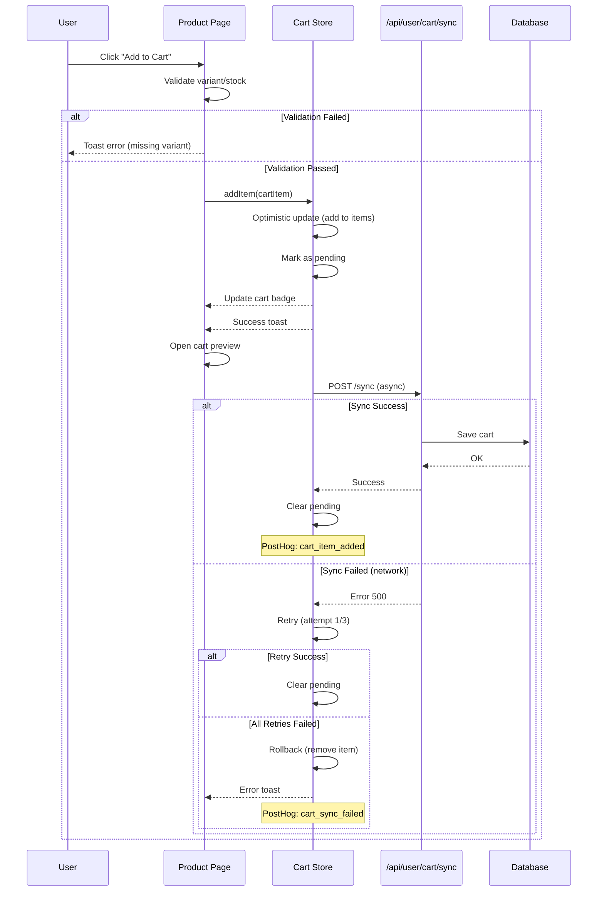
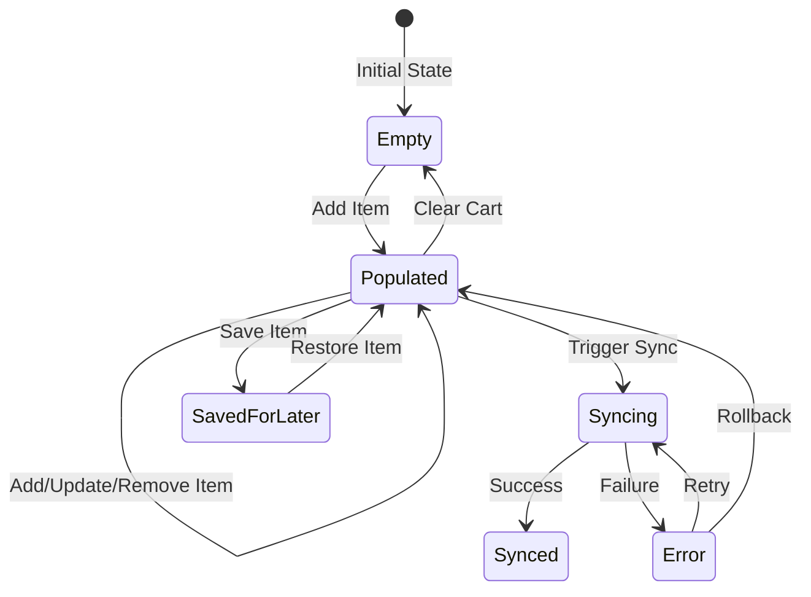
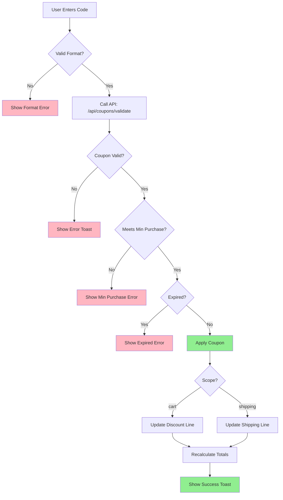

# 🛒 Cart Workflow Documentation

Comprehensive documentation for Mientior's shopping cart system, covering architecture, implementation, testing, and troubleshooting.

---

## 📋 Table of Contents

1. [Architecture Overview](#architecture-overview)
2. [Components](#components)
3. [State Management](#state-management)
4. [API Integration](#api-integration)
5. [User Flow Diagrams](#user-flow-diagrams)
6. [Testing Strategy](#testing-strategy)
7. [Error Handling](#error-handling)
8. [Analytics & Monitoring](#analytics--monitoring)
9. [Troubleshooting Guide](#troubleshooting-guide)
10. [Performance Optimization](#performance-optimization)

---

## 🏗️ Architecture Overview

The cart system follows a **client-first optimistic update pattern** with server synchronization for authenticated users.

### Key Principles

- **Optimistic Updates**: UI updates immediately before server confirmation
- **Offline-First**: Cart persists in localStorage, works without network
- **Progressive Enhancement**: Basic functionality for guests, full features for authenticated users
- **Error Resilience**: Automatic retry with exponential backoff
- **Type Safety**: Full TypeScript coverage with Zod validation

### Tech Stack

- **State**: Zustand with localStorage persistence
- **Validation**: Zod schemas
- **Networking**: Fetch with retry logic
- **Caching**: Redis for server-side cart data
- **Analytics**: PostHog event tracking
- **Testing**: Vitest (unit), Playwright (E2E)

---

## 🧩 Components

### 1. Cart Store (`src/stores/cart.store.ts`)

**Purpose**: Centralized cart state management with Zustand

**Key Features**:
- ✅ Optimistic updates with rollback
- ✅ Automatic server sync for authenticated users
- ✅ Retry with exponential backoff (3 attempts)
- ✅ Pending operation tracking
- ✅ Error queue with contextual messages
- ✅ PostHog analytics integration

**State Shape**:
```typescript
{
  items: CartItem[]
  savedForLater: SavedForLaterItem[]
  appliedCoupon?: CouponCode
  pendingOperations: Map<string, PendingOperation>
  errors: CartError[]
  isSyncing: boolean
  lastSyncedAt: Date | null
}
```

**Core Actions**:
- `addItem(item)` - Add item with optimistic update
- `removeItem(id)` - Remove item
- `updateQuantity(id, quantity)` - Update quantity (debounced in UI)
- `clearCart()` - Clear all items and coupons
- `saveForLater(id)` - Move item to "Saved for Later"
- `moveToCart(id)` - Restore saved item
- `applyCoupon(coupon)` - Apply promo code
- `syncToServer()` - Manual sync trigger

**Calculations** (Client-side estimates):
- `getSubtotal()` - Sum of all items
- `getDiscount()` - Coupon discount amount
- `getShipping()` - Shipping cost (with free threshold)
- `getTax()` - Tax (18% VAT)
- `getTotal()` - Final total
- `getFreeShippingProgress()` - Progress to free shipping

> ⚠️ **Important**: These calculations are estimates. For checkout, use `/api/checkout/calculate-totals` which accounts for delivery zones and real-time rates.

---

### 2. Product Card (`src/components/products/product-card.tsx`)

**Purpose**: Displays product in grid/list with quick add to cart

**Features**:
- Variant selection (size, color)
- Stock validation
- Wishlist toggle
- Quick view modal
- Responsive images with lazy loading
- Accessibility (ARIA labels, keyboard navigation)

**Props**:
```typescript
{
  id: string
  name: string
  slug: string
  price: number
  compareAtPrice?: number
  image?: string
  rating?: number
  reviewCount?: number
  badge?: { text: string; variant: 'new' | 'sale' | 'featured' | 'limited' }
  stock?: number
  showCartButtonInInfo?: boolean
  onQuickView?: (id: string) => void
}
```

---

### 3. Enhanced Quantity Selector (`src/components/products/enhanced-quantity-selector.tsx`)

**Purpose**: Debounced quantity input with visual feedback

**Features**:
- ✅ 500ms debounce on changes
- ✅ "Saving..." indicator
- ✅ Min/max validation
- ✅ Keyboard-friendly
- ✅ Disabled state during sync

**Usage**:
```tsx
<EnhancedQuantitySelector
  value={quantity}
  min={1}
  max={stock}
  onChange={(newQty) => updateQuantity(itemId, newQty)}
  disabled={isPending}
  debounceMs={500}
/>
```

---

### 4. Real-Time Stock Hook (`src/hooks/use-real-time-stock.ts`)

**Purpose**: Monitor stock changes with polling

**Features**:
- ✅ 30-second polling interval
- ✅ Toast notifications on stock changes
- ✅ Automatic pause on unmount
- ✅ Manual refetch capability

**Usage**:
```tsx
const { stock, inStock, isLoading, refetch } = useRealTimeStock({
  productId: 'prod-123',
  variantId: 'var-456',
  pollingInterval: 30000,
  enabled: true
})
```

**Notification Triggers**:
- Product goes out of stock → Warning toast
- Stock drops below 10 → Info toast
- Product back in stock → Success toast

---

## 🗂️ State Management

### Cart Item Structure

```typescript
interface CartItem {
  id: string                    // Unique cart item ID (product-variant combo)
  productId: string             // Reference to product
  productName: string
  productSlug: string
  productImage: string
  price: number                 // Price in cents (e.g., 5000 = $50.00)
  quantity: number
  variant?: {
    size?: string
    color?: string
    sku?: string
  }
  stock: number                 // Available stock
  inStock?: boolean             // Explicitly track availability
  maxQuantity?: number          // Max orderable quantity
  compareAtPrice?: number       // Original price (for discount calc)
  badge?: string                // Product badge (NEW, SALE, etc.)
  freeShipping?: boolean        // Eligible for free shipping
}
```

### localStorage Persistence

Persisted state (survives page refresh):
```json
{
  "items": [],
  "savedForLater": [],
  "appliedCoupon": {}
}
```

Non-persisted (runtime only):
```json
{
  "pendingOperations": {},
  "errors": [],
  "isSyncing": false,
  "lastSyncedAt": null
}
```

---

## 🔌 API Integration

### Endpoints

#### 1. **POST `/api/user/cart/sync`**
Sync local cart to server (authenticated users only)

**Request**:
```json
{
  "items": CartItem[],
  "savedForLater": SavedForLaterItem[],
  "appliedCoupon": CouponCode | undefined
}
```

**Response**:
```json
{
  "success": true,
  "data": {
    "items": CartItem[],
    "savedForLater": SavedForLaterItem[],
    "appliedCoupon": CouponCode | undefined
  }
}
```

**Error Codes**:
- `401` - Not authenticated
- `400` - Invalid payload
- `500` - Server error (triggers retry)

---

#### 2. **GET `/api/user/cart/load`**
Load cart from server (on login)

**Response**:
```json
{
  "success": true,
  "data": {
    "items": CartItem[],
    "savedForLater": SavedForLaterItem[],
    "appliedCoupon": CouponCode | undefined
  }
}
```

---

#### 3. **GET `/api/products/stock?productId=X&variantId=Y`**
Check real-time stock

**Response**:
```json
{
  "stock": 5,
  "inStock": true,
  "lastUpdated": "2025-01-15T10:30:00Z"
}
```

---

## 📊 User Flow Diagrams

### 1. Add to Cart Flow (PDP)



---

### 2. Cart State Transitions



---

### 3. Coupon Application Flow



---

## 🧪 Testing Strategy

### Unit Tests (`src/stores/__tests__/cart.store.test.ts`)

**Coverage**: 15 test cases covering all core actions and calculations

**Key Scenarios**:
1. ✅ Add new item
2. ✅ Increment quantity if exists
3. ✅ Add separate items for different variants
4. ✅ Remove item
5. ✅ Update quantity
6. ✅ Clear cart
7. ✅ Save for later
8. ✅ Move to cart
9. ✅ Merge quantities when restoring
10. ✅ Apply percentage coupon
11. ✅ Apply fixed coupon
12. ✅ Calculate subtotal
13. ✅ Calculate discount (with clamping)
14. ✅ Calculate shipping (with free threshold)
15. ✅ Calculate tax and total
16. ✅ Free shipping progress
17. ✅ Merge with server cart (max quantity)

**Run Tests**:
```bash
npm test -- cart.store.test.ts
```

---

### Utility Tests (`src/lib/__tests__/cart-utils.test.ts`)

**Coverage**: `createCartItem`, `isCartItemInStock`, `getMaxQuantity`

**Key Scenarios**:
- ✅ Create item without variant
- ✅ Create item with variant (price modifier)
- ✅ Set inStock based on stock
- ✅ Handle free shipping threshold
- ✅ Fallback for legacy items (missing inStock)

---

### E2E Tests (`tests/e2e/cart-workflow.spec.ts`)

**Coverage**: 8 critical user flows

**Scenarios**:
1. ✅ Add product from PDP with variant selection
2. ✅ Add product from PLP (quick add)
3. ✅ Error on missing variant
4. ✅ Handle out-of-stock products
5. ✅ Update quantity with debouncing
6. ✅ Save for later and restore
7. ✅ Apply coupon code
8. ✅ Persist cart after refresh

**Run E2E Tests**:
```bash
# Install Playwright first
npm install -D @playwright/test
npx playwright install

# Run tests
npm run test:e2e

# Run specific test
npx playwright test cart-workflow.spec.ts

# Run in UI mode (debug)
npx playwright test --ui
```

---

## 🛡️ Error Handling

### Error Types

```typescript
interface CartError {
  type: 'network' | 'stock' | 'validation' | 'unknown'
  message: string
  operation: PendingOperation
  itemId?: string
  retryCount?: number
}
```

### Retry Strategy

**Exponential Backoff**:
- Attempt 1: Immediate
- Attempt 2: 1s delay
- Attempt 3: 2s delay
- Attempt 4: 4s delay

**Retry Conditions**:
- ✅ Network errors (5xx, timeout)
- ✅ Rate limiting (429)
- ❌ Validation errors (4xx except 429)

**Rollback Triggers**:
- All retry attempts exhausted
- Non-retryable error (4xx)
- User cancellation

### Error Messages

| Scenario | Toast Message | Action |
|----------|---------------|--------|
| Missing variant | "Veuillez sélectionner une taille/couleur" | Block add |
| Out of stock | "Ce produit n'est plus disponible" | Block add |
| Sync failed | "Échec de l'ajout au panier. Veuillez réessayer." | Rollback |
| Stock changed | "Le stock a changé. Veuillez vérifier." | Update UI |
| Coupon expired | "Ce code promo a expiré" | Reject |

---

## 📈 Analytics & Monitoring

### PostHog Events

#### 1. `cart_item_added`
```json
{
  "productId": "prod-123",
  "productName": "T-Shirt Bleu",
  "variantId": "SKU-M-BLUE",
  "variantSize": "M",
  "variantColor": "Blue",
  "quantity": 2,
  "price": 5000,
  "currency": "USD"
}
```

#### 2. `cart_item_removed`
```json
{
  "productId": "prod-123",
  "productName": "T-Shirt Bleu",
  "reason": "user"
}
```

#### 3. `cart_coupon_applied`
```json
{
  "code": "SAVE10",
  "discount": 10,
  "type": "percentage",
  "scope": "cart"
}
```

#### 4. `cart_sync_failed`
```json
{
  "operation": "add",
  "productId": "prod-123",
  "error": "Network timeout"
}
```

### Key Metrics to Monitor

- **Cart Abandonment Rate**: `(cart_created - checkout_completed) / cart_created`
- **Add to Cart Success Rate**: `cart_item_added / (cart_item_added + cart_sync_failed)`
- **Average Cart Value**: `sum(cart_totals) / count(carts)`
- **Coupon Usage Rate**: `cart_coupon_applied / cart_created`

---

## 🔧 Troubleshooting Guide

### Problem: Items disappear from cart after refresh

**Possible Causes**:
1. localStorage disabled/full
2. Safari private mode
3. Browser extension clearing storage

**Solution**:
```javascript
// Check localStorage availability
if (typeof window !== 'undefined' && window.localStorage) {
  try {
    localStorage.setItem('test', 'test')
    localStorage.removeItem('test')
    console.log('✅ localStorage available')
  } catch (e) {
    console.error('❌ localStorage unavailable:', e)
  }
}
```

---

### Problem: Cart not syncing to server

**Debug Steps**:
1. Check authentication status
```javascript
const session = await getSession()
console.log('Session:', session)
```

2. Check network tab for `/api/user/cart/sync` calls
3. Verify payload format
4. Check server logs for errors

**Common Fixes**:
- Ensure `PRISMA_DATABASE_URL` is set
- Verify Better Auth session is valid
- Check Redis connection for rate limiting

---

### Problem: Duplicate items in cart

**Cause**: Variant matching logic issue

**Fix**: Ensure consistent JSON stringification
```typescript
const idx = items.findIndex((i) =>
  i.id === item.id &&
  JSON.stringify(i.variant) === JSON.stringify(item.variant)
)
```

---

### Problem: Free shipping not calculating correctly

**Cause**: Using client-side estimate instead of server calculation

**Fix**: For checkout, always use `/api/checkout/calculate-totals`
```typescript
const response = await fetch('/api/checkout/calculate-totals', {
  method: 'POST',
  body: JSON.stringify({
    items,
    deliveryAddress,
    shippingMethod
  })
})
```

---

## ⚡ Performance Optimization

### 1. Debouncing Quantity Updates

**Implementation**: `enhanced-quantity-selector.tsx`

**Impact**: Reduces API calls from 10/sec to 2/sec during rapid changes

**Configuration**:
```tsx
<EnhancedQuantitySelector debounceMs={500} />
```

---

### 2. Optimistic Updates

**Benefit**: Zero perceived latency for add/remove actions

**Trade-off**: Requires rollback on failure

**Metrics**:
- Perceived latency: 0ms
- Actual latency: 200-500ms (masked)

---

### 3. localStorage Batching

**Current**: Zustand auto-persists on every state change

**Optimization** (if needed):
```typescript
persist(
  (set, get) => ({ ... }),
  {
    name: 'cart-storage',
    partialize: (state) => ({ /* only essential state */ }),
    merge: (persistedState, currentState) => ({ ...currentState, ...persistedState })
  }
)
```

---

### 4. Real-Time Stock Polling

**Current**: 30-second interval

**Optimization**:
- Pause polling on tab blur
- Use WebSocket for instant updates (future)

```typescript
useEffect(() => {
  const handleVisibilityChange = () => {
    if (document.hidden) {
      // Pause polling
    } else {
      // Resume polling
    }
  }

  document.addEventListener('visibilitychange', handleVisibilityChange)
  return () => document.removeEventListener('visibilitychange', handleVisibilityChange)
}, [])
```

---

## 🎯 Best Practices

### For Developers

1. **Always validate variants before adding to cart**
```typescript
if (product.variants && product.variants.length > 0 && !selectedVariant) {
  toast.error('Veuillez sélectionner une taille et une couleur')
  return
}
```

2. **Use cart utils for CartItem creation**
```typescript
import { createCartItem } from '@/lib/cart-utils'

const cartItem = createCartItem({
  product,
  variant: selectedVariant,
  quantity: selectedQuantity
})
```

3. **Check stock before adding**
```typescript
const { stock, inStock } = useRealTimeStock({ productId, variantId })

if (!inStock) {
  toast.error('Ce produit n\'est plus disponible')
  return
}
```

4. **Use getters for calculations**
```typescript
const subtotal = useCartStore((state) => state.getSubtotal())
const total = useCartStore((state) => state.getTotal())
```

---

### For Testers

1. **Test variant combinations thoroughly**
   - All sizes with all colors
   - Missing size or color
   - Out of stock variants

2. **Test offline scenarios**
   - Add items offline → go online → verify sync
   - Modify items offline → refresh → verify persistence

3. **Test edge cases**
   - Add 999 quantity (max validation)
   - Apply expired coupon
   - Apply coupon not meeting min purchase
   - Multiple rapid adds (debouncing)

---

## 📚 Additional Resources

- [Zustand Documentation](https://docs.pmnd.rs/zustand/getting-started/introduction)
- [Playwright Documentation](https://playwright.dev/)
- [PostHog Analytics Guide](https://posthog.com/docs)
- [Better Auth Documentation](https://www.better-auth.com/docs)

---

## 🔄 Changelog

### v2.0.0 (2025-01-15)
- ✅ Added optimistic updates with rollback
- ✅ Implemented retry with exponential backoff
- ✅ Added PostHog analytics tracking
- ✅ Created comprehensive test suite (unit + E2E)
- ✅ Added debouncing to quantity selector
- ✅ Implemented real-time stock monitoring
- ✅ Enhanced error handling with contextual messages

### v1.0.0 (Initial Release)
- Basic cart functionality
- localStorage persistence
- Server sync for authenticated users

---

## 🤝 Contributing

When contributing to the cart system:

1. ✅ Write tests for new features
2. ✅ Update this documentation
3. ✅ Add PostHog events for new actions
4. ✅ Follow error handling patterns
5. ✅ Test offline scenarios

---

**Last Updated**: 2025-01-15
**Maintained by**: Mientior Engineering Team
